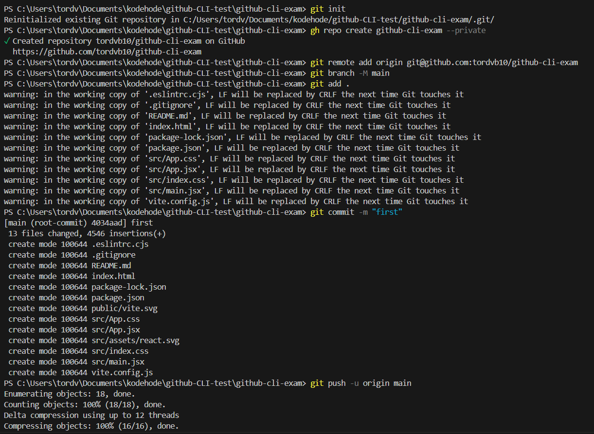

# Set up project on github from command line

This project is a test projct where everything was done through the command line, no mouse cliking or webbrowser viewing.

The picture below illustrate the code I needed to run in order to make this work. First you'd need som program on your computer, if you not allready have:
<ol>
    <li>
        <a href="https://git-scm.com/downloads">link to install GitHub on your computer.</a>
    </li>
    <li>
        <a href="https://cli.github.com/">link to install GitHub Cli on your computer.</a>
    </li>
</ol>

Then you'd need to run the code to connect your device to the github client, and follow the instructions:


```
git auth login
```


</img>

